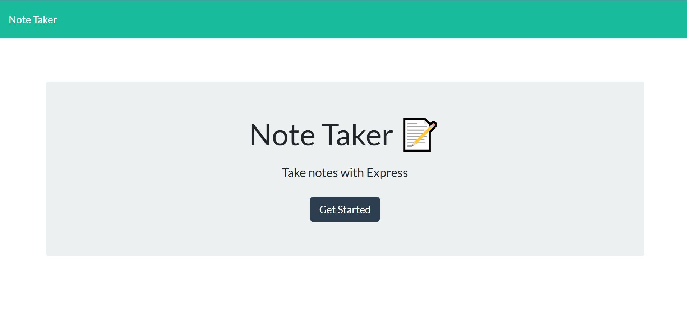

# Note Taker

The assignment for this project was to modify starter code to create an application called Note Taker that can be used to write and save notes. This application will use an Express.js back end and will save and retrieve note data from a JSON file.  The application’s front end has already been created. It's your job to build the back end, connect the two, and then deploy the entire application to Heroku.

[Application Link](https://git.heroku.com/boiling-hollows-65517.git)

## Technology Used

    HTML
    CSS
    JavaScript
    NodeJS

    Heroku - where the application is deployed

    Node Modules:
        Express - for server code
        UUID - for random ID generator

## Table of Contents
    
- [Installation](#installation)
- [Usage](#usage)
- [Contribute](#Contribute)
- [License](#license)
- [Testing](#testing)
- [Questions?](#questions?)
- [Resources](#resources)

## Installation

Be sure to download Nodejs. You can find details on downloading and using Node in the resource section below. There are several node modules that will require installation as well.

## Usage

Access using the deployed link. Follow screen shots below for a more visual guide.

## Contribute

Contact me for more details. This is a solo project for a UWBoot Camp homework assignment.

## Licensing

[MIT License](https://github.com/git/git-scm.com/blob/main/MIT-LICENSE.txt)

    Permissions
        - Commercial use
        - Distribution
        - Modification
        - Private use

    Conditions
        - License and copyright notice

    Limitations
        - Liability
        - Warranty

## Testing
    
    No user tests were written for this project.

## Questions?

Github: (https://github.com/Mike-C-Sanders)
Email: mike@mikecsanders.com

## Resources

1. [Nodejs](https://nodejs.org/en/)
2. [Express](http://expressjs.com/)
3. [UUID](https://www.npmjs.com/package/uuid)